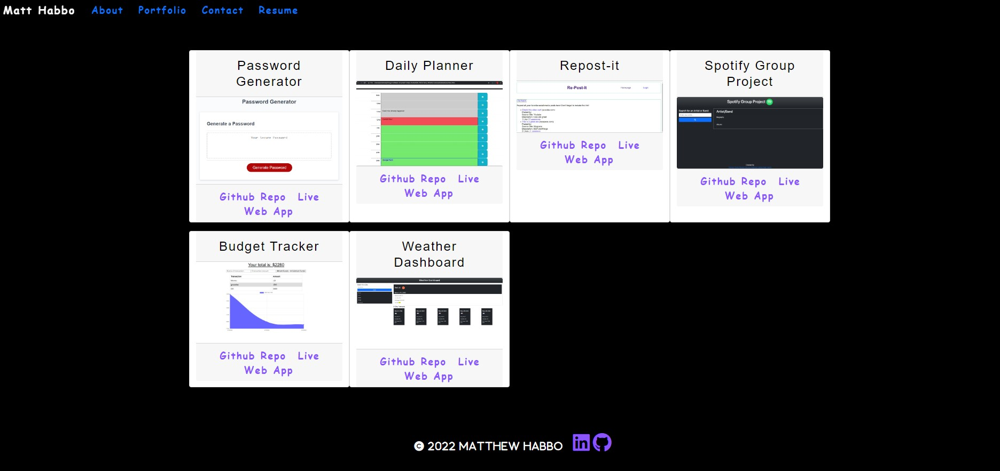

# React Portfolio
https://mhabbo01.github.io/react-portfolio/ 

## Description 

This project is a React.js version of my web developing portfolio.

# Installation

To get started with a brand new React project:

* In your terminal, cd into the directory in which you'd like your project to be stored
* run ```npx create-react-app``` "name of your app"
* cd into your new app and run ```npm install```


## Usage

* run ```npm start``` to see your app's progress while writing your code as it updating once you save your edits!

# Screenshot


## Deployed Application
https://mhabbo01.github.io/react-portfolio/ 


